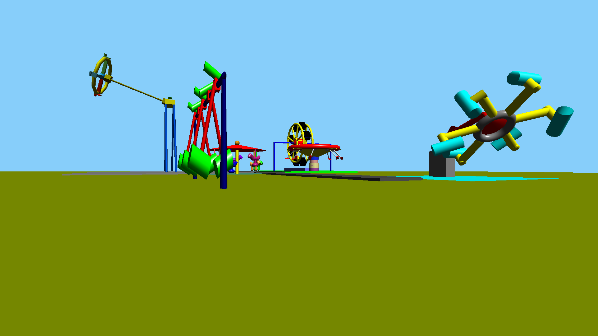

# Parque de diversiones en OpenGL (padOpenGL)

## Descripcción:
Parque de diversiones programado en C++ utilizando OpenGL y GLUT.

## libs/headers:
- GL
- GLUT
- math

## Miembros del grupo:
- [Arribasplata, Luis](https://github.com/SaCSeBaS)
- [Esparza, Jose](https://github.com/pebeto)
- Guevara, Miguel
- [Jacobs, Bruno](https://github.com/brunojacobs1)
- [Quiroz, Johan](https://github.com/JohanQuiroz)
- [Vásquez, Mario](https://github.com/mariovasquez)
